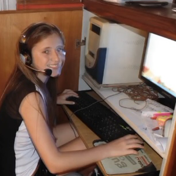

# TP0-CV
## Sobre mí:
Mi nombre es Catalina Correa, estudiante de **Programación Informática** en la Universidad Nacional de San Martín (UNSAM). Entusiasta de la programación, hice cursos de **Desarrollo Web Front-end** y **Fullstack Java**. También poseo conocimientos básicos/intermedios en lenguajes como: C, C++, Python, SQL y ***Assembler*** !!!!!!!
<!--  -->
 <- yo

### ⋆˚࿔ Videojuegos Fav 𝜗𝜚˚⋆
> - Uncharted **4** (Los otros me dieron miedo, pero igual hermosos)
> - Stanley Parable
> - Planet Crafter (eu muy bueno desde el early lo juro, tremendo lore)
> - Stardew Valley ✧.*
> - Minecraft 1.5.2 [con shaders]
> - posiblemente Undertale (no lo jugue todavía, pero si.)

